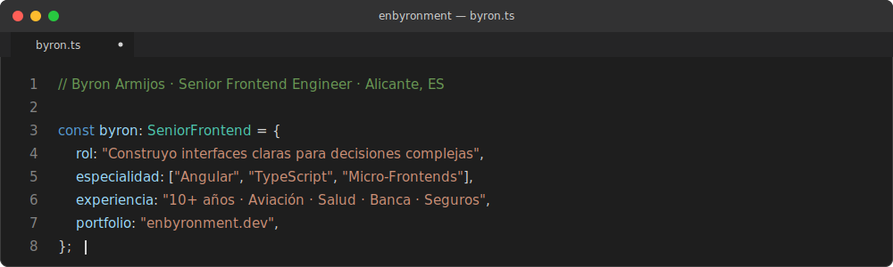

<div align="center">



<br>

[**enbyronment.dev →**](https://enbyronment.dev) ·
[LinkedIn](https://www.linkedin.com/in/byjosedev/) ·
[CV.pdf](https://enbyronment.dev/cv_byron_armijos_capitole.pdf) ·
[byjose007@gmail.com](mailto:byjose007@gmail.com)

</div>

---

## Ahora

```typescript
const currentRole = {
  empresa:  "Vueling Airlines",
  via:      "Capitole Consulting",
  rol:      "Senior Frontend Engineer",
  desde:    "Febrero 2024",
  enfoque: [
    "SPAs críticas de operaciones aeroportuarias y RRHH",
    "Angular 19 · Signals · WCAG 2.1 AA",
    "AI-assisted delivery (Figma → producción)",
  ],
};
```

---

## Sobre mí

```typescript
const byron: SeniorFrontend = {
  especialidad:  ["Angular 17–19", "TypeScript", "Micro-Frontends"],
  capa_extra:    ["UX/UI", "Design Systems", "Accesibilidad WCAG 2.1 AA"],
  bff_fullstack: ["NestJS", "Node.js", "Python"],
  dominios:      ["Aviación", "Salud", "Banca", "Seguros"],
  experiencia:   "10+ años",
  filosofía:
    "La pantalla debe pensar por ti, no pedirte que pienses por ella.",
};
```

---

## Stack

```yaml
frontend:
  - Angular 17–19
  - TypeScript
  - Signals · RxJS · NgRx
  - Standalone Components
  - Micro-Frontends · Lazy Loading
  - SCSS · Tailwind · Angular Material

design_ux:
  - Figma
  - Design Systems · Design Tokens
  - Style Dictionary · Atomic Design
  - WCAG 2.1 AA · axe DevTools · Lighthouse

ai_workflow:
  - Claude Code · Antigravity
  - Google Gemini · Figma AI · GitHub Copilot
  - Spec-Driven Development

bff_fullstack:
  - NestJS · Node.js · Python
  - WebSockets · REST APIs
  - MongoDB · PostgreSQL
  - Azure CI/CD

iot_cross_platform:   # secundario
  - Ionic
  - Raspberry Pi · ESP32
```

---

## Trabajo seleccionado

| Año | Cliente | Proyecto | Stack |
| --- | --- | --- | --- |
| `2020–pres.` | Vueling | **Design System** — Librería cross-product | Angular Material · Tailwind · Design Tokens |
| `2021–23` | BCI Bank | **One Stop Shop** — Portal bancario unificado | Micro-frontends · Design System compartido |
| `2022–25` | Vueling | **VY People PRL** — Prevención riesgos laborales | Divulgación progresiva · Validación inline |
| `2023` | BCI Health | **[Pegasi](https://enbyronment.dev/case-studies/pegasi.html)** — Software oncológico | Angular · NestJS BFF · Micro-FE · WCAG 2.1 AA |
| `2024` | Vueling | **VY People AenaBadge** — Acreditaciones AENA | Stepper multi-paso · Gestión de roles |
| `2024` | Vueling | **VY People EmergencyRoster** — Cobertura plantillas | Calendario/lista · Filtros por prioridad |
| `2026` | Vueling | **[VY Vortex](https://enbyronment.dev/case-studies/vy-vortex.html)** — Disrupciones tiempo real | Angular 19 · Signals · WebSocket · CDK D&D |

Los proyectos enlazados tienen case study completo en [enbyronment.dev](https://enbyronment.dev).

---

## Notas

Aprendizajes que valió la pena escribir:

- [Por qué sigo apostando por Angular para proyectos largos](https://enbyronment.dev/notes/por-que-angular.html) — la estructura como guardrail
- [Signals y RxJS: usar cada uno donde realmente aporta valor](https://enbyronment.dev/notes/signals-vs-rxjs.html) — elegir herramienta, no bando
- [Cómo integrar la IA sin perder el control del proyecto](https://enbyronment.dev/notes/claude-code.html) — la IA acelera lo que entiendes
- [La diferencia entre una pantalla correcta y una útil](https://enbyronment.dev/notes/vy-vortex-demo.html) — mostrar todo no es informar
- [Reducir la carga cognitiva en formularios complejos](https://enbyronment.dev/notes/mostrar-menos.html) — mostrar menos, mostrar a tiempo

---

## Hablemos

```yaml
disponible: Senior Frontend (Angular preferentemente)
sectores:   producto · healthtech · fintech · govtech
modalidad:  remoto · híbrido (Alicante) · presencial UE
motiva:     equipos donde UX no es la última capa,
            sino parte del diseño desde el primer commit
```

[enbyronment.dev](https://enbyronment.dev) · [LinkedIn](https://www.linkedin.com/in/byjosedev/) · [byjose007@gmail.com](mailto:byjose007@gmail.com)

---

<div align="center">

```typescript
// Construido con criterio, no con plantilla.
```

</div>
